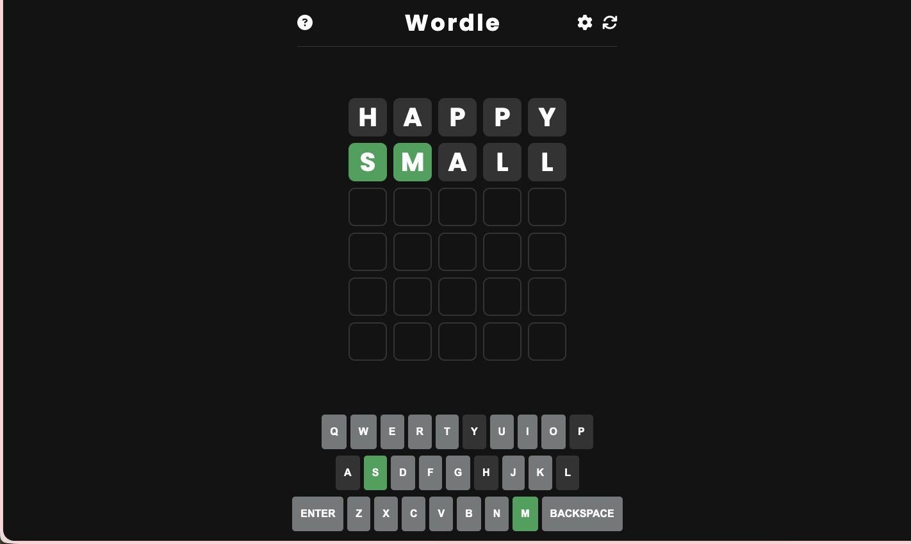
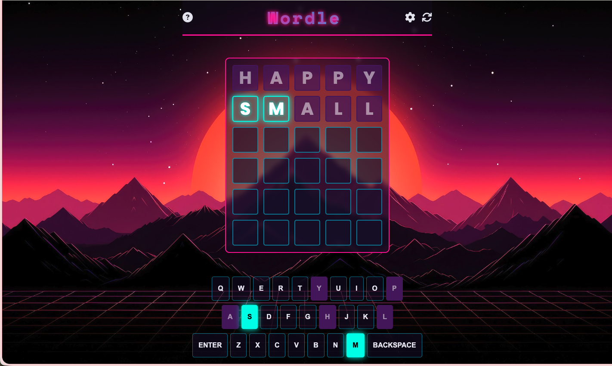
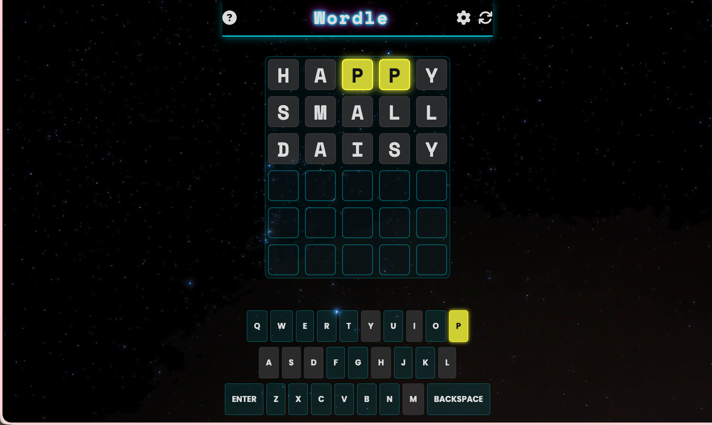
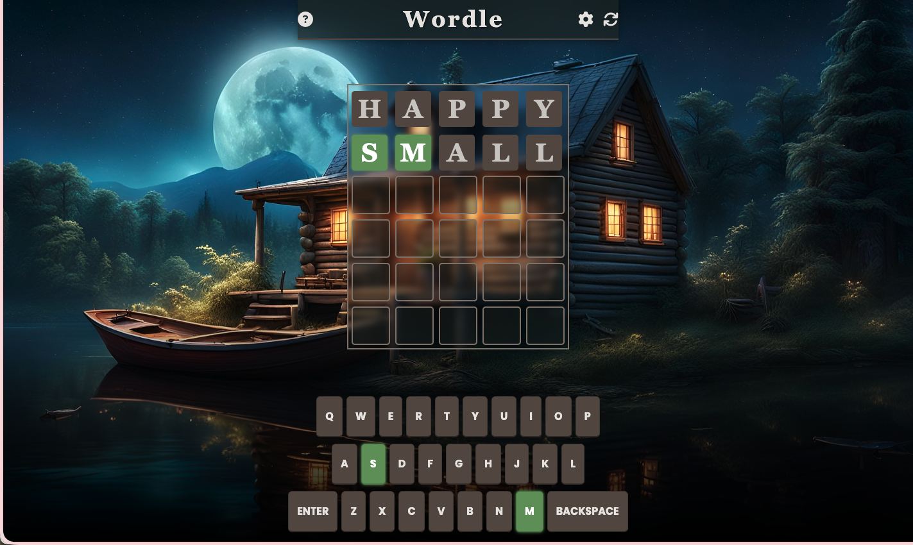
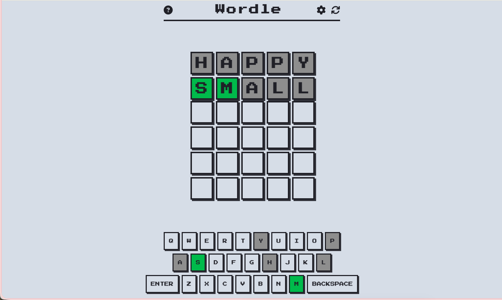
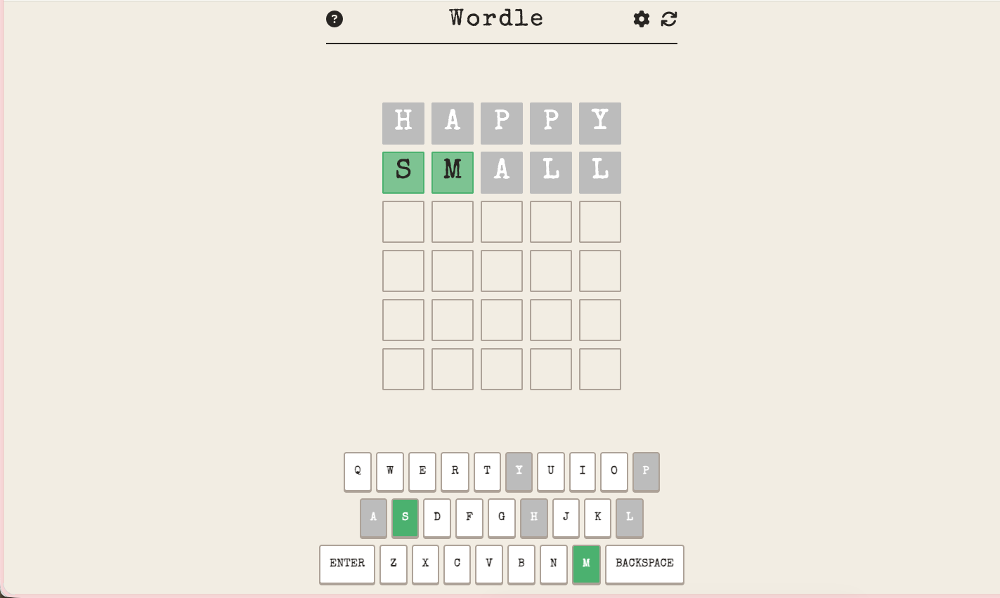
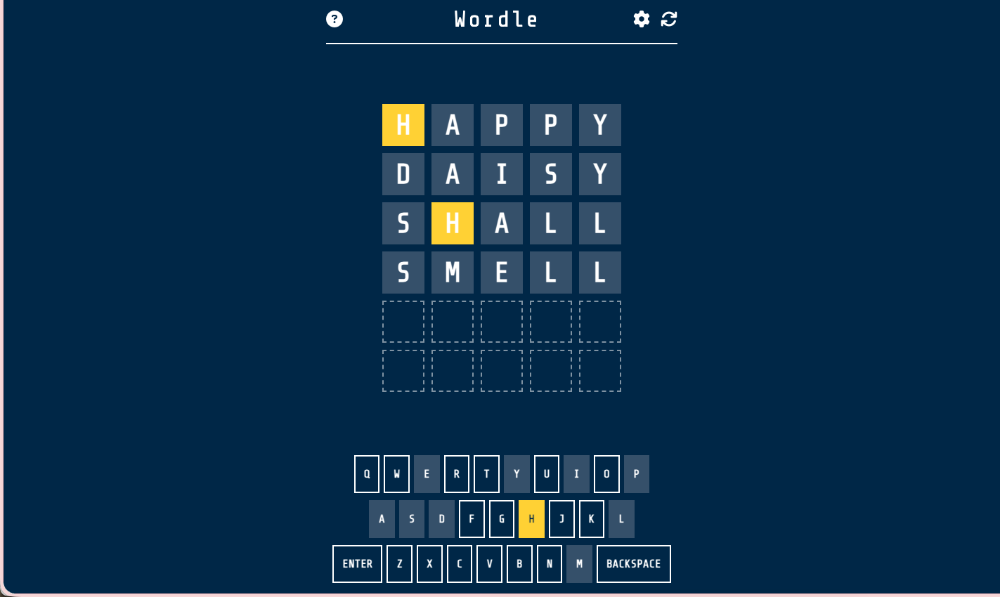
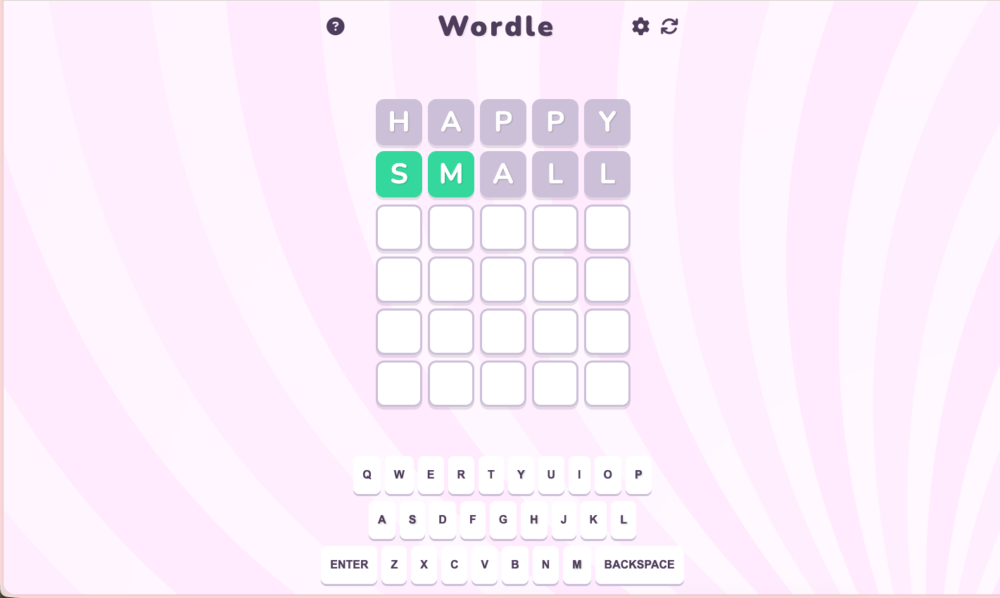

# 🎨 Wordle

A feature-rich, fully customizable app of the popular word-guessing game, built with vanilla JavaScript, HTML, and CSS. This project focuses on a powerful theming engine that allows for endless visual customization.

### [➡️ Live Demo (https://contact2mayurkukadiya.github.io/Wordle/)](#)

---

### Skins
|                     Default (Dark)                      |                        Synthwave                        |                          Astro                          |                         Verdant                         |
| :-----------------------------------------------------: | :-----------------------------------------------------: | :-----------------------------------------------------: | :-----------------------------------------------------: |
|  |  |  |  |

|                          8-Bit                          |                         Scribe                          |                        Blueprint                        |                        Bubblegum                        |
| :-----------------------------------------------------: | :-----------------------------------------------------: | :-----------------------------------------------------: | :-----------------------------------------------------: |
|  |  |  |  |


## ✨ Key Features

This isn't just a standard Wordle. It's packed with features designed for a rich user experience and developer flexibility.

### Core Gameplay
- **Classic Wordle Rules**: Guess the 5-letter word in 6 tries.
- **Valid Word Dictionary**: The game checks against a comprehensive word list to prevent invalid guesses.
- **Dual Keyboard Support**: Play using the interactive on-screen keyboard or your physical keyboard.
- **Revealing Tile Animations**: Smooth, satisfying flip animations on every guess.
- **End-of-Game Modals**: Clear victory and defeat screens that show the correct word if you lose.

### 🎨 Extensive Theming Engine
The standout feature of this project is its powerful and easy-to-expand theming system. The game currently includes **10+ unique themes**:
- **Default (Light/Dark)**: The classic, clean Wordle experience.
- **Astro**: A futuristic, cosmic theme with neon glows.
- **Synthwave**: A retro 80s theme with vibrant colors and a sunset background.
- **Verdant**: A calm, nature-inspired theme with earthy tones.
- **8-Bit**: A pixel-perfect retro gaming theme.
- **Scribe**: An analog theme styled after parchment and typewriters.
- **Blueprint**: A technical schematic with crisp lines on a blue background.
- **Bubblegum**: A playful and bright theme with soft, rounded corners.
- **Nautical**: A classic maritime theme with a wood-grain finish.
- **Terminal**: A retro hacker theme with a CRT screen feel.

### ⚙️ Customization & Settings
- **Multiple Difficulty Levels**: Choose between **Easy**, **Medium**, and **Hard** word lists.
- **Persistent Settings**: Your chosen theme and difficulty are saved in `localStorage` for your next visit.
- **On-Screen Keyboard Only Mode**: An accessibility option to disable physical keyboard input.
- **Dark & Light Modes**: The "Default" theme includes a toggle for a comfortable viewing experience day or night.

## 💻 Technologies Used
- **HTML5**
- **CSS3** (with CSS Variables for easy theming)
- **Vanilla JavaScript** (ES6+, structured within an IIFE)
- **External Libraries**:
  - [Font Awesome](https://cdnjs.com/libraries/font-awesome) for icons.
  - [Google Fonts](https://fonts.google.com/) for theme-specific typography.

## 🚀 Getting Started

To run this project on your local machine, follow these simple steps.

### Prerequisites
You only need a modern web browser that can run HTML, CSS, and JavaScript.

### Installation
1.  Clone the repository to your local machine:
    ```sh
    git clone https://github.com/your-username/wordle-clone.git
    ```
2.  Navigate to the project directory:
    ```sh
    cd wordle-clone
    ```
3.  Open the `index.html` file in your browser. You can do this by double-clicking the file or right-clicking and selecting "Open with..." your browser of choice.

That's it! The game is now running locally.

## 🔧 How to Add a New Theme
The project was designed to be easily extensible. Adding your own custom theme is simple:

1.  **Add Assets**: Place your new theme's background image (if any) in the `/assets` folder.
2.  **Create CSS File**: Create a new `.css` file for your theme inside the `/themes` folder (e.g., `my-theme.css`). Use one of the existing theme files as a template to override the default styles.
3.  **Import Fonts (Optional)**: If your theme uses a custom font, add the font import link to the `<head>` of `index.html`.
4.  **Add the Theme Option**: Open `index.html` and add a new `<option>` to the theme dropdown menu inside the settings modal:
    ```html
    <select id="theme-dropdown">
      <!-- other themes -->
      <option value="my-theme.css">My Theme</option>
    </select>
    ```
    The `value` must match the filename you created in the `/themes` folder.

## 📁 Project Structure

```
WORDLE/
├── assets/             # All static assets like images
│ ├── background.jpg
│ ├── 8bit-bg.png
│ └── ...
├── themes/             # CSS files for each theme
│ ├── default.css
│ ├── astro.css
│ └── ...
├── index.html          # Main HTML file for the game structure
├── style.css           # Core layout and structural CSS
├── script.js           # Main game logic
├── words.js            # Contains the word lists for all difficulties
└── README.md           # You are here!
```

## ⚖️ License
This project is licensed under the MIT License. See the `LICENSE` file for details.

## 🙏 Acknowledgements
- Inspired by the original Wordle game created by Josh Wardle.